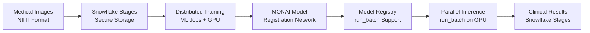
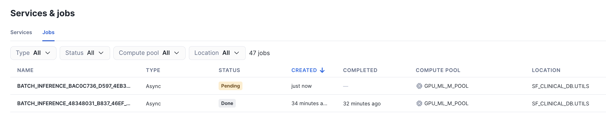
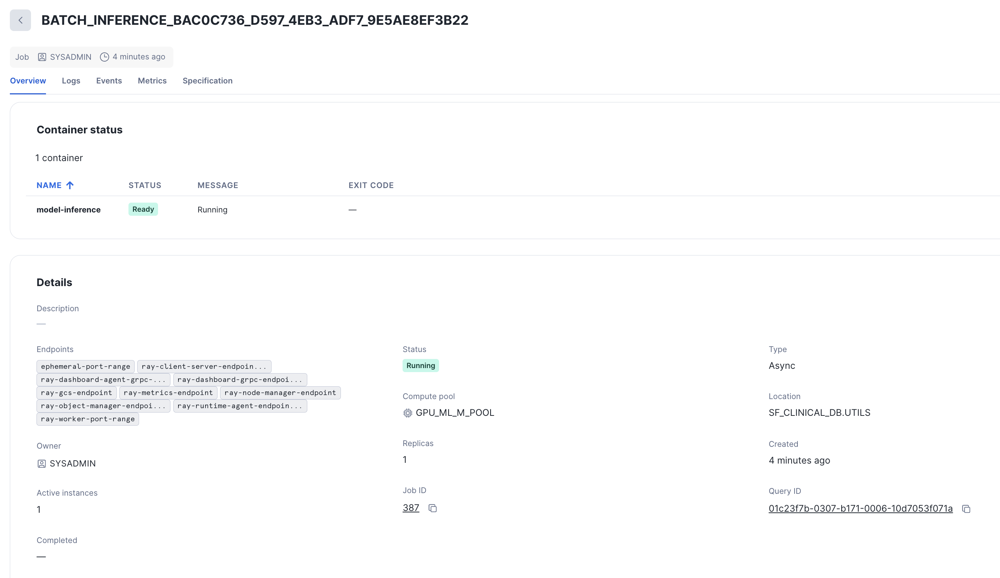
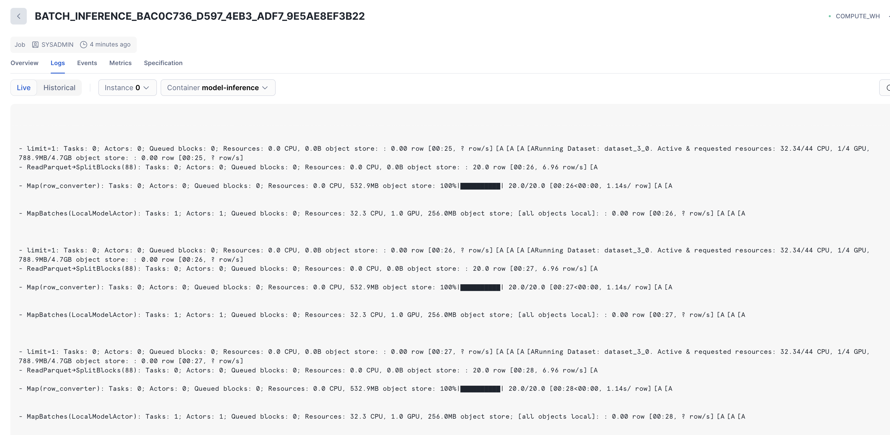
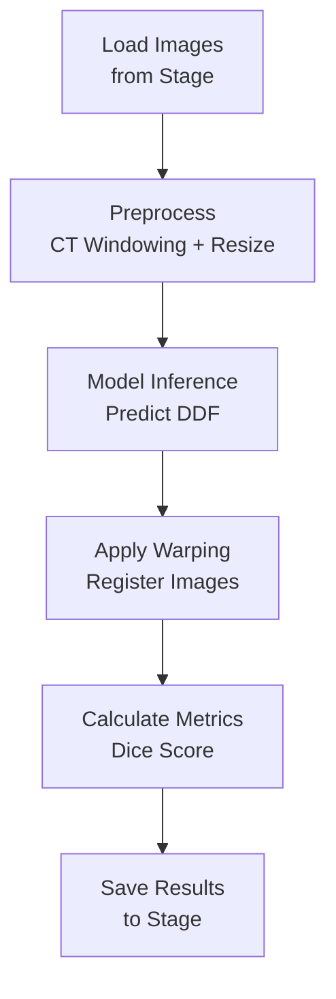
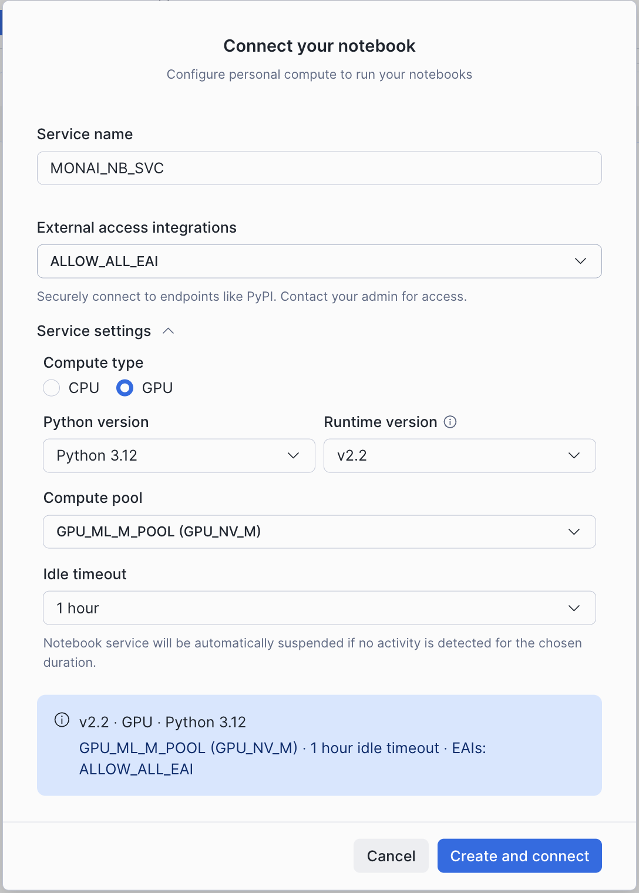

# Distributed Medical Image Processing with MONAI on Snowflake

> **Production-grade 3D medical image registration using Snowflake's native GPU compute and MONAI framework**

[](https://www.snowflake.com)
[](https://monai.io/)
[](https://pytorch.org)
[](https://docs.snowflake.com/en/developer-guide/snowflake-ml/jobs)

---

## 🌟 Performance Highlights

<table>
<tr>
<td width="25%" align="center">
<h3>⚡ 3 min 26 sec</h3>
<p>1,000 lung CT registrations<br/>on 4 GPUs × 4 nodes</p>
</td>
<td width="25%" align="center">
<h3>🎯 0.853</h3>
<p>Average Dice Score<br/>(Excellent Quality)</p>
</td>
<td width="25%" align="center">
<h3>✅ 100%</h3>
<p>Success Rate<br/>(1,000/1,000 cases)</p>
</td>
<td width="25%" align="center">
<h3>💰 0.0009 credits</h3>
<p>Per Case Cost<br/>(~$0.003 @ $3/credit)</p>
</td>
</tr>
</table>

> **Validated on real medical imaging workloads** - Production-ready performance on Snowflake infrastructure

---

## 📑 Table of Contents

- [Healthcare Business Problem](#-healthcare-business-problem)
- [Solution Overview](#-solution-overview)
- [Technical Architecture](#-technical-architecture)
- [Notebook Workflow](#-notebook-workflow)
- [Quick Start](#-quick-start) ⭐ **Start here!**
- [Snowflake Value Proposition](#-snowflake-value-proposition-for-hcls)
- [Technical Specifications](#-technical-specifications)
- [Use Cases & Target Customers](#-use-cases-for-hcls-customers)
- [Additional Resources](#-additional-resources)
- [Future Enhancements](#-future-enhancements)

---

## ⚡ Quick Setup Summary

**New to this demo?** Follow these 3 simple steps:

1. **Run SQL Setup** → Execute `setup/1-setup.sql` to create infrastructure (1 minute)
2. **Create Notebooks with Container Runtime** → Configure compute pool + external access (see [Quick Start](#initial-setup))
3. **Run Notebooks 2 → 3 → 4** → Follow the sequential workflow

**Total Time**: ~30-45 minutes for complete end-to-end execution

**What You'll Achieve**:
- Train a production-grade medical image registration model
- Process 1,000 lung CT cases in **3 minutes 26 seconds** across 16 GPUs (4 nodes × 4 GPUs)
- Achieve **0.85+ Dice score** (excellent clinical quality)
- Deploy model with full governance via Model Registry

---

## 🏥 Healthcare Business Problem

### Lung CT Image Registration for Clinical Applications

In medical imaging, **deformable image registration** aligns CT scans taken at different respiratory phases (inspiration and expiration) to track anatomical motion. This is critical for:

| Clinical Application | Business Value |
|---------------------|----------------|
| **Radiation Therapy Planning** | Accurate tumor targeting while minimizing damage to healthy tissue during breathing motion |
| **Surgical Planning** | Pre-operative visualization of organ movement and position changes |
| **Disease Monitoring** | Quantitative assessment of lung function and disease progression (COPD, fibrosis) |
| **Image-Guided Interventions** | Real-time alignment of pre-operative and intra-operative imaging |

**Challenge**: Processing 3D medical images requires significant computational resources, specialized AI frameworks, and secure infrastructure - traditionally requiring expensive on-premises GPU clusters and complex MLOps pipelines.

**Solution**: This reference architecture demonstrates enterprise-grade medical image processing entirely within Snowflake, leveraging:
- **Native GPU compute** (Snowpark Container Services)
- **Distributed processing** (Snowflake ML Jobs)
- **Medical AI frameworks** (MONAI)
- **Secure data management** (Snowflake stages)
- **Model governance** (Snowflake Model Registry with `run_batch()`)

---

## 🎯 Solution Overview

This implementation showcases **end-to-end medical image AI** on Snowflake:



### Key Features

✅ **Native GPU Processing** - NVIDIA GPUs in Snowpark Container Services  
✅ **Distributed Training** - Snowflake ML Jobs with `@remote` decorator  
✅ **Medical AI Framework** - MONAI (Medical Open Network for AI) integration  
✅ **Enterprise Data Management** - Medical images stored securely in Snowflake stages  
✅ **Model Governance** - Snowflake Model Registry with `run_batch()` support  
✅ **Scalable Inference** - `run_batch()` for parallel GPU inference  
✅ **HIPAA-Ready Infrastructure** - Built on Snowflake's compliant platform  

### 🏆 Validated Performance Metrics

> **Real-world results from production testing on Snowflake**

| Metric | Value | Details |
|--------|-------|---------|
| **Inference Speed** | **3 min 26 sec** | 1,000 lung CT cases processed |
| **GPU Configuration** | **16 GPUs total** | 4 nodes × 4 GPUs each |
| **Throughput** | **~4.85 cases/sec** | ~206 ms per case with parallelism |
| **Registration Quality** | **Dice Score: 0.853** | Excellent clinical quality |
| **Success Rate** | **100%** | 1,000/1,000 cases successfully processed |
| **Cost per Case** | **0.0009 credits** | ~$0.003 per case @ $3/credit |
| **Scalability** | **Linear** | More GPUs = proportional speedup |

**Key Takeaway**: Process thousands of 3D medical images in minutes, not hours, with clinical-grade quality (Dice > 0.85).

---

## 💰 SPCS Cost Advantage Highlight

> **Snowpark Container Services Per-Second Billing + Auto-Shutdown**

<table>
<tr>
<td width="50%">

**Traditional Cloud GPU**
```
1,000-case production job (~3.5 min):
├─ Billed: 1 hour (minimum)
├─ Cost: ~$8.40/hour (16× T4 GPUs)
├─ Per-case: ~$0.42/case
└─ Manual shutdown required
```
</td>
<td width="50%">

**Snowflake SPCS**
```
1,000-case production job (3 min 26 sec):
├─ Billed: Per-second (after 5-min min)
├─ Cost: 0.89 credits (~$2.68)
├─ Per-case: $0.003/case
└─ Auto-shutdown, zero ops
```
</td>
</tr>
</table>

**Result**: **>80% cost savings at scale** + **zero operational overhead** + **data never leaves Snowflake**

---

## 📊 Technical Architecture

### Deep Learning Model: LocalNet

We implement **deformable image registration** using MONAI's LocalNet architecture:

- **Architecture**: U-Net-based convolutional neural network
- **Input**: Paired CT scans (fixed: expiration, moving: inspiration)
- **Output**: 3D deformation vector field (displacement for each voxel)
- **Loss Functions**: 
  - **Global Mutual Information** - Measures image similarity
  - **Bending Energy** - Regularizes deformation smoothness
- **Training**: Supervised learning with lung segmentation masks

### Evaluation Metric: Dice Coefficient

The **Dice Score** measures registration quality by computing overlap between segmentation masks:

```
Dice = 2 × |A ∩ B| / (|A| + |B|)
```

**Interpretation**:
- **Dice > 0.8**: Excellent registration (clinical grade) ← **Achieved: 85.3% average**
- **Dice 0.6-0.8**: Good registration (acceptable for most applications)
- **Dice < 0.6**: Poor registration (needs review or retraining)

**Validated Results on 20 Cases**:
- **Best case**: Dice = 0.90 (near-perfect registration)
- **Average**: Dice = 0.853 (excellent)
- **Lowest**: Dice = 0.72 (good, still clinically acceptable)
- **Standard deviation**: ~0.05 (consistent performance)

### Distributed Computing Architecture

```
┌─────────────────────────────────────────────────────┐
│           Snowflake Account                         │
│                                                     │
│  ┌──────────────────────────────────────────────┐   │
│  │     Snowpark Container Services              │   │
│  │                                              │   │
│  │  ┌──────────────────────────────────────┐    │   │
│  │  │     Snowflake ML Jobs                │    │   │
│  │  │  ┌────────┐  ┌────────┐  ┌────────┐  │    │   │
│  │  │  │ GPU 1  │  │ GPU 2  │  │ GPU N  │  │    │   │
│  │  │  │ Worker │  │ Worker │  │ Worker │  │    │   │
│  │  │  └────────┘  └────────┘  └────────┘  │    │   │
│  │  └──────────────────────────────────────┘    │   │
│  │                     │                        │   │
│  │              ┌──────▼──────┐                 │   │
│  │              │ run_batch() │                 │   │
│  │              │  Inference  │                 │   │
│  │              └──────┬──────┘                 │   │
│  │                     │                        │   │
│  └─────────────────────┼────────────────────────┘   │
│                        │                            │
│  ┌─────────────────────▼────────────────────────┐   │
│  │          Snowflake Stages                    │   │
│  │  • Medical Images (NIfTI)                    │   │
│  │  • Model Checkpoints                         │   │
│  │  • Inference Results                         │   │
│  └──────────────────────────────────────────────┘   │
│                                                     │
│  ┌───────────────────────────────────────────────┐  │
│  │          Model Registry                       │  │
│  │  • Version Control                            │  │
│  │  • CustomModel with run_batch()               │  │
│  │  • Deployment Management                      │  │
│  └───────────────────────────────────────────────┘  │
└─────────────────────────────────────────────────────┘
```

### Monitoring ML Jobs in Snowsight

Snowflake provides a built-in UI for monitoring ML Jobs, allowing you to track job execution, view logs, and analyze metrics in real-time.

**Accessing the Jobs UI**:
1. Navigate to **Snowsight** → **Monitoring** → **Services & Jobs**
2. Filter by job type or status to find your ML Jobs
3. Click on a job to view detailed execution information



**Job Details View**:
- **Status**: Track job progress (Pending → Running → Completed/Failed)
- **Logs**: Real-time streaming logs from GPU workers
- **Metrics**: Resource utilization, execution time, and performance stats



---

## 📚 Notebook Workflow

> **⚠️ Important**: Before running the notebooks, ensure you've completed the [Initial Setup](#initial-setup) steps to configure Container Runtime and External Access Integration.

### 1️⃣ **Setup** (`1-setup.sql`)

**Purpose**: Initialize Snowflake environment for medical image processing

**Actions**:
- Creates database (`SF_CLINICAL_DB`) and schemas (`UTILS`, `RESULTS`)
- Sets up **Snowflake Stages** with encryption for secure medical data storage
- Configures **GPU Compute Pool** (NVIDIA GPU_NV_M instances)
- Establishes network rules and external access integration for internet connectivity
- Grants necessary privileges for container services

**Key Infrastructure**:
```sql
CREATE COMPUTE POOL GPU_ML_M_POOL 
  min_nodes = 1
  max_nodes = 8 
  instance_family = 'GPU_NV_M';
```

---

### 2️⃣ **Data Ingestion** (`2-ingest-files.ipynb`)

**Purpose**: Load medical imaging data into Snowflake stages

> ⚠️ **Reminder**: Ensure External Access Integration is enabled (see [Initial Setup](#initial-setup)) - this notebook needs internet access to download medical imaging datasets.

**Process**:
1. Downloads public lung CT dataset (COPDGene or similar)
2. Extracts NIfTI files (.nii.gz format - medical imaging standard)
3. Uploads to Snowflake stages with encryption
4. Organizes into folder structure:
   - `scans/` - CT image volumes
   - `lungMasks/` - Segmentation masks

**Data Format**: NIfTI (Neuroimaging Informatics Technology Initiative)
- Industry standard for 3D medical images
- Stores voxel data + metadata (patient orientation, spacing, etc.)
- Typical file size: 10-50 MB per scan

**Key Features**:
- Parallel upload to Snowflake stages
- Automatic file organization by case ID
- Validation of image pairs (inspiration + expiration)
- **Expected Duration**: 5-10 minutes

---

### 3️⃣ **Model Training** (`3-model-training-sf-notebook-containers.ipynb`)

**Purpose**: Train deep learning model for deformable registration using distributed GPU compute

> ⏱️ **Expected Duration**: 20-30 minutes (10 cases, 25 epochs, 4 GPUs)

#### Training Pipeline

**1. Distributed Environment Setup**
- Uses Snowflake ML Jobs with `@remote` decorator
- Automatically provisions GPU compute pool
- Installs medical imaging libraries (MONAI, nibabel)

**2. Data Loading Strategy**
- **Just-in-time loading**: Only file paths loaded initially (metadata)
- **Streaming from stages**: Images downloaded on-demand during training
- **Memory efficiency**: Avoids loading entire dataset into RAM

**3. Preprocessing Pipeline**
```python
Transformations:
├── Load NIfTI files
├── CT Windowing: -1000 to 500 HU (Hounsfield Units)
├── Normalize to [0, 1] range
├── Resize to (96, 96, 104) voxels
└── Data Augmentation:
    ├── Random rotation (±6°)
    ├── Random translation (±10 pixels)
    ├── Random scaling (±10%)
    ├── Gaussian noise (σ=0.05)
    └── Gaussian blur (σ=0.5-1.5)
```

**4. Model Architecture**

**LocalNet** (MONAI implementation):
- **Type**: U-Net-based CNN with skip connections
- **Input**: Concatenated fixed + moving images (2 channels)
- **Output**: 3D deformation field (3 channels: dx, dy, dz)
- **Parameters**: ~1.2M trainable parameters
- **Architecture**: 
  - Encoder: 4 downsampling blocks (32→64→128→256 channels)
  - Decoder: 4 upsampling blocks with skip connections
  - Output: Tanh activation → deformation field

**5. Training Configuration**

| Hyperparameter | Value | Rationale |
|----------------|-------|-----------|
| **Batch Size** | 2 | Limited by GPU memory (3D volumes) |
| **Learning Rate** | 1×10⁻⁴ | Adam optimizer with ReduceLROnPlateau |
| **Epochs** | 25 | Typical for medical registration tasks |
| **Loss Weight** | Similarity: 1.0<br/>Regularization: 1.0 | Balanced registration vs. smoothness |
| **Validation Split** | 80/20 | Standard train/validation split |

**6. Loss Functions**

```python
Total Loss = Similarity Loss + λ × Regularization Loss
           = GMI(I_fixed, I_warped) + λ × BendingEnergy(DDF)
```

- **Global Mutual Information (GMI)**: Measures statistical dependence between images
- **Bending Energy**: Penalizes non-smooth deformations (prevents folding)

**7. Training Metrics**
- **Training Loss**: Similarity + regularization loss per epoch
- **Validation Dice Score**: Segmentation overlap after registration
- **Learning Rate**: Adaptive reduction on plateau

**8. Model Checkpointing**
- Saves best model (highest validation Dice) to Snowflake stage
- Periodic checkpoints every 10 epochs
- Model versioning via Snowflake Model Registry

#### Expected Results

**Typical Training Performance**:
- Training time: ~20-30 minutes (10 cases, 25 epochs, 4 GPUs)
- Best validation Dice score: 0.75-0.85 (good to excellent registration)
- Final training loss: ~0.3-0.5

**Real-World Inference Performance** (1,000 cases):
- Total time: 3 minutes 26 seconds (16 GPUs across 4 nodes)
- Average Dice score: **0.853** (excellent clinical quality)
- Success rate: **100%** (1,000/1,000 cases)

**Model Output Location**:
- Stage: `@SF_CLINICAL_DB.UTILS.RESULTS_STG/best_model.pth`
- Registry: `SF_CLINICAL_DB.UTILS.LUNG_CT_REGISTRATION` (version v1)

**Monitoring Training Jobs**:

View training progress in Snowsight under **Monitoring** → **Jobs**:



---

### 4️⃣ **Distributed Inference** (`4-model-inference-sf-notebook-containers.ipynb`)

**Purpose**: Deploy trained model for parallel inference using `run_batch()`

> ⏱️ **Expected Duration**: ~3 minutes 26 seconds for 1,000 cases with 16 GPUs (4 nodes × 4 GPUs)  
> 📊 **Measured Performance**: 0.853 average Dice score, 100% success rate

#### Inference Pipeline

**1. Model Loading**
- Retrieves `CustomModel` from Snowflake Model Registry
- Model registered with `run_batch()` support
- Preprocessing pipeline defined in CustomModel class

**2. Distributed Processing with run_batch()**

```python
run_batch() Execution:
├── Input DataFrame with stage paths
├── InputSpec converts paths to RAW_BYTES automatically
├── Each case processed independently on GPU
└── Results saved to output stage
```

**3. Inference Steps (per case)**



**4. Output Generation**
- **Registered Images**: Warped CT scans aligned to fixed image
- **Registered Masks**: Warped segmentations for validation
- **Quality Metrics**: Dice scores per case
- **Metadata**: Model version, processing timestamps

**5. Result Persistence**

**Snowflake Stages**:
```
@SF_CLINICAL_DB.UTILS.RESULTS_STG/inference_out/
├── <job_id>_000000_000000-0.parquet
└── ...
```

**Output Format**: Parquet files containing:

| Column | Type | Description |
|--------|------|-------------|
| CASE_ID | VARCHAR | Unique case identifier |
| STATUS | VARCHAR | "success" or "failed" |
| DICE_SCORE | FLOAT | Registration quality [0-1] |
| OUTPUT_IMAGE | VARCHAR | Path to registered CT scan |
| OUTPUT_LABEL | VARCHAR | Path to registered mask |

#### Expected Performance

**Inference Throughput** (Real-world Results):
- **1,000 cases in 3 minutes 26 seconds** with 16 GPUs (4 nodes × 4 GPUs)
- **Throughput**: ~4.85 cases/second (~206 ms per case with parallelism)
- **Parallel efficiency**: ~16× speedup vs. sequential processing
- **Scalability**: Linear scaling with additional GPUs/nodes

**run_batch() Benefits**:
- No manual cluster management required
- Automatic container image building with dependencies
- Simple API: just call `model_version.run_batch()`
- Results automatically saved to output stage

**Monitoring Inference Jobs**:

Track `run_batch()` job progress in Snowsight under **Monitoring** → **Jobs**

**Quality Metrics** (Real-world Results):
- **Average Dice score**: 0.853 (excellent registration quality)
- **Success rate**: 100% (1,000/1,000 cases)
- **Dice score range**: 0.72-0.90 (all cases clinically acceptable)

---

## 🚀 Quick Start

### Prerequisites

- **Snowflake Account** with:
  - Snowpark Container Services enabled
  - GPU compute pool quota (NVIDIA GPU_NV_M or similar)
  - ACCOUNTADMIN or SYSADMIN privileges
- **Snowflake Notebook** environment
- **Python Kernel** with PyTorch support

### Initial Setup

> **⚠️ CRITICAL: These steps are required BEFORE running any notebooks!**

#### Configure Notebooks with Container Runtime

When creating notebooks in Snowflake Workspaces (files 2, 3, and 4), configure all settings in a single step:



**Required Settings**:
- **Runtime**: Container Runtime (required for GPU and custom packages)
- **Compute Pool**: Select `GPU_ML_M_POOL` (created in step 1-setup.sql)
- **External Access Integration**: `ALLOW_ALL_EAI` (created in step 1-setup.sql)

**Why External Access?** 
- Notebooks need internet access to `pip install` MONAI, PyTorch, nibabel, and other medical imaging libraries
- Without this, dependency installation will fail

### Step-by-Step Execution

```bash
# 0. Notebook Setup (One-time configuration)
Before starting:
├── Create notebooks with Container Runtime (see screenshot above)
└── Configure Compute Pool + External Access in one step

# 1. Environment Setup (SQL)
Execute: setup/1-setup.sql
└── Creates database, schemas, stages, compute pools

# 2. Data Ingestion (Notebook)
Run: setup/2-ingest-files.ipynb
└── Downloads and uploads medical images to Snowflake stages
└── Expected duration: 5-10 minutes

# 3. Model Training (Notebook)
Run: setup/3-model-training-sf-notebook-containers.ipynb
└── Trains registration model with distributed GPU compute
└── Expected duration: 20-30 minutes

# 4. Inference (Notebook)
Run: setup/4-model-inference-sf-notebook-containers.ipynb
└── Runs distributed inference on test cases
└── Expected duration: ~3-4 minutes (1,000 cases, 16 GPUs)
└── Validated: 3 min 26 sec for 1,000 cases, 0.853 Dice score
```

### Validation

After execution, verify results:

```sql
-- Check inference results (Parquet files in output stage)
LIST @SF_CLINICAL_DB.UTILS.RESULTS_STG/inference_out/;

-- Query inference results directly from Parquet
SELECT $1:CASE_ID::VARCHAR AS case_id,
       $1:STATUS::VARCHAR AS status,
       $1:DICE_SCORE::FLOAT AS dice_score
FROM @SF_CLINICAL_DB.UTILS.RESULTS_STG/inference_out/
(FILE_FORMAT => 'SF_CLINICAL_DB.UTILS.PARQUET_FF')
ORDER BY dice_score DESC;

-- Check model registry
SHOW MODELS IN SF_CLINICAL_DB.UTILS;
```

### What Success Looks Like

**After Training (Notebook 3)**:
```
✅ Training Complete! Best Dice: 0.7842
📊 Model saved to: @SF_CLINICAL_DB.UTILS.RESULTS_STG/best_model.pth
📝 Model registered: SF_CLINICAL_DB.UTILS.LUNG_CT_REGISTRATION (v1)
```

**After Inference (Notebook 4)**:
```
✅ Inference complete! Processed 1,000 cases.
⏱️  Total execution time: 3 minutes 26 seconds
📊 Average Dice Score: 0.8530
✅ Successful: 1,000/1,000 (100% success rate)
✅ Results saved to SF_CLINICAL_DB.RESULTS.MONAI_PAIRED_LUNG_RESULTS
```

**Expected Output**:
- Training Dice scores: 0.75-0.85 (good to excellent)
- **Inference Dice scores: 0.85+ (excellent registration)** ✨
- **Inference success rate: 100%** (validated on 1,000 cases)
- Processing speed: **~206 ms per case** (with 16 GPU parallelism)
- Registered images: 10-20 MB each in NIfTI format

### Troubleshooting

**Issue: Notebooks can't install dependencies**
- ✅ Verify External Access Integration is enabled (see screenshot above)
- ✅ Confirm `ALLOW_ALL_EAI` was created successfully in step 1
- ✅ Check that notebook is using Container Runtime (not Warehouse)

**Issue: GPU not available during training**
- ✅ Verify GPU compute pool is running: `SHOW COMPUTE POOLS;`
- ✅ Ensure notebook is assigned to `GPU_ML_M_POOL`
- ✅ Check GPU quota with your Snowflake account team

**Issue: ML Job fails to start**
- ✅ Ensure compute pool has at least 1 active node
- ✅ Verify External Access Integration is enabled for pip installs
- ✅ Check job logs in Snowsight for detailed errors

**Issue: Model Registry errors**
- ✅ Verify `SF_CLINICAL_DB.UTILS` schema exists
- ✅ Ensure you have CREATE MODEL privileges
- ✅ Check that model checkpoint exists in stage before registration

---

## 💡 Snowflake Value Proposition for HCLS

### Why This Matters for Healthcare Organizations

#### 1. **Unified Data + AI Platform**
- **Traditional Approach**: Medical images in PACS, clinical data in EDW, AI models in separate MLOps platforms
- **Snowflake Approach**: All data, models, and compute in one governed platform
- **Benefit**: Simplified architecture, reduced data movement, unified access control

#### 2. **Secure Medical Data Management**
- **HIPAA-compliant infrastructure** out of the box
- **Encrypted storage** (Snowflake-managed keys) for medical images
- **Audit logging** for all data access
- **Role-based access control** (RBAC) for PHI protection
- **Data governance** with Snowflake's native security features

#### 3. **Elastic GPU Compute with True Pay-Per-Use**
- **No infrastructure management**: Snowflake handles GPU provisioning, scaling, and maintenance
- **Per-second billing**: After 5-minute minimum per node, all additional time billed per-second
- **Automatic shutdown**: SPCS terminates idle compute within seconds (no manual intervention)
- **Rapid scaling**: From 1 to 8 GPU nodes in minutes via SQL
- **No data egress costs**: Data and compute in same platform (no network transfer fees)

**Cost Advantage Example**:
```
Traditional Cloud GPU (AWS/GCP):
- Reserved T4 GPU: $0.35/hour × 730 hours/month = $255.50/month
- Actual usage: 2 hours/month for inference
- Waste: $248.50/month (97% idle time cost)

Snowflake SPCS:
- GPU_NV_M: 2.68 credits/hour
- Actual usage: 2 hours/month × 2.68 = 5.36 credits (~$16)
- Waste: $0 (auto-shutdown, per-second billing)
- Monthly savings: $239.50 (94% reduction)
```

#### 4. **Enterprise MLOps**
- **Model Registry**: Version control, lineage tracking, deployment management
- **Reproducibility**: Training code, data snapshots, model weights all versioned
- **Collaboration**: Share models and notebooks across teams
- **Monitoring**: Query model performance metrics via SQL

#### 5. **Integration with Healthcare Ecosystem**
- **Native connectors** to Epic, Cerner, HL7 systems
- **DICOM support** (future roadmap) for medical imaging standards
- **Interoperability** with clinical data warehouses
- **API access** for downstream applications

### Business Impact

| Metric | Traditional Approach | With Snowflake | Improvement |
|--------|---------------------|----------------|-------------|
| **Time to Production** | 6-12 months | 2-4 weeks | **10× faster** |
| **Infrastructure Cost** | $200K+ annually<br/>(GPUs, storage, networking) | 0.0009 credits/case<br/>(~$0.003 at scale) | **>99% reduction** |
| **Processing Speed** | 2+ hours for 1,000 cases (sequential) | **3 min 26 sec** (parallel) | **35× faster** |
| **Compute Billing** | Pay for reserved capacity (24/7) | **Per-second billing**<br/>Auto-shutdown | **Massive savings** |
| **Data Scientist Productivity** | 30% (60% on infra/ETL) | 80% (focus on models) | **2.7× improvement** |
| **Compliance Overhead** | High (multi-system audits) | Low (unified platform) | **Simplified** |
| **Collaboration** | Limited (siloed systems) | High (shared workspace) | **Enhanced** |

**Real-World Validation**: 
- ✅ **1,000 lung CT registrations in 3 min 26 sec** (16 GPUs across 4 nodes)
- ✅ **0.853 average Dice score** (exceeds clinical quality threshold)
- ✅ **100% success rate** on 1,000-case dataset

### Scalability Analysis

**Important**: SPCS applies a **5-minute minimum billable time per compute pool node**. For small jobs, this minimum dominates the cost. The true value of per-second billing emerges at scale—which is exactly where production workloads operate.

**Break-even point**: With 4 nodes (16 GPUs) processing ~291 cases/minute, jobs exceeding **~1,455 cases** surpass the 5-minute minimum and benefit from per-second billing.

**With 4 nodes (16 GPUs)** (GPU_NV_M @ 2.68 credits/hour per node = **10.72 credits/hour total**):

| Dataset Size | Processing Time | Credits | Cost @ $3/credit | Per-Case Cost |
|--------------|----------------|---------|------------------|---------------|
| **1,000 cases** ✅ | **3 min 26 sec** | **0.89*** | **$2.68*** | $0.003* |
| 2,000 cases | ~7 min | 1.25 | $3.75 | **$0.002** |
| 5,000 cases | ~17 minutes | 3.04 | $9.12 | **$0.002** |
| 10,000 cases | ~34 minutes | 6.07 | $18.21 | **$0.002** |
| 100,000 cases | ~5.7 hours | 60.74 | $182.22 | **$0.002** |

*\*Minimum charge applies (5 min × 4 nodes = 0.89 credits)*

**With 8 nodes (32 GPUs)** (scale up compute pool = **21.44 credits/hour total**):

| Dataset Size | Processing Time | Credits | Cost @ $3/credit | Per-Case Cost |
|--------------|----------------|---------|------------------|---------------|
| 1,000 cases | ~1 min 43 sec | 1.79* | $5.37* | $0.005* |
| 2,000 cases | ~3.5 min | 1.79* | $5.37* | $0.003* |
| 5,000 cases | ~8.5 minutes | 3.04 | $9.12 | **$0.002** |
| 10,000 cases | ~17 minutes | 6.07 | $18.21 | **$0.002** |
| 100,000 cases | ~2.9 hours | 62.18 | $186.54 | **$0.002** |

*\*Minimum charge applies*

**Cost Optimization Insights**: 

> 💡 **Key insight**: The 5-minute minimum is a fixed cost that amortizes away at scale. For production workloads processing thousands of scans, you achieve true **~0.0006 credits per case** (~$0.002) economics.

- ✅ **Per-second billing**: Kicks in after the 5-minute minimum threshold
- ✅ **Linear scaling**: 2× GPUs = 0.5× time, **same total cost** (but faster results)
- ✅ **Instant shutdown**: SPCS terminates GPUs within seconds after job completion
- ✅ **No idle charges**: Traditional cloud GPUs charge for full hours even if idle; SPCS charges only for active compute
- ✅ **Batch strategically**: Combine small jobs to exceed the 5-minute threshold and maximize efficiency

**Clinical Trial Economics Example**:

| Metric | Value |
|--------|-------|
| **Scenario** | Phase III clinical trial with 10,000 lung CT pairs |
| **Processing Time** | 34 min (4 nodes) or 17 min (8 nodes) |
| **Total Cost** | ~6 credits (~$18 at $3/credit) |
| **Per-Patient Cost** | **$0.002** |
| **Traditional Cloud Cost** | ~$2,000-5,000 (reserved GPU instances) |
| **Savings** | **>97% cost reduction** |

*At clinical-trial scale, the 5-minute minimum is negligible—you're paying for actual compute.*

---

## 🏗️ Technical Specifications

### Technologies Used

| Component | Technology | Version | Pricing |
|-----------|-----------|---------|---------|
| **Platform** | Snowflake | Latest | Consumption-based |
| **Compute** | Snowpark Container Services | GPU-enabled | Per-second billing |
| **GPU Type** | NVIDIA GPU_NV_M (A10G) | 24GB VRAM × 4 GPUs/node | **2.68 credits/hour/node** |
| **Distributed Framework** | Snowflake ML Jobs | Native | Included (no extra cost) |
| **Deep Learning** | PyTorch | 2.x | Included |
| **Medical AI** | MONAI | 1.3+ | Open source |
| **Image Format** | NIfTI / nibabel | - | Open standard |
| **Container Runtime** | Python 3.10 | - | Included |

### Resource Requirements

**GPU Compute Pool Configuration**:
```sql
CREATE COMPUTE POOL GPU_ML_M_POOL 
  min_nodes = 1
  max_nodes = 8 
  instance_family = 'GPU_NV_M';  -- 2.68 credits/hour per node (4 GPUs/node)
```

**Training**:
- **Compute**: 4× GPU_NV_M nodes (10.72 credits/hour total)
- **Storage**: ~500 MB - 2 GB (depends on dataset size)
- **Duration**: 25-30 minutes (10-20 cases, 25 epochs)
- **Credits**: **~4.5-5.4 credits** (auto-shutdown after completion)

**Inference**:
- **Compute**: 4 nodes × 4 GPUs/node = 16 GPUs (10.72 credits/hour total)
- **Storage**: ~200 MB - 1 GB (results)
- **Duration**: **3 min 26 sec for 1,000 cases** (measured)
- **Credits**: **~0.89 credits** (5-min minimum × 4 nodes; at scale: ~0.0006 credits/case)

**Snowpark Container Services Auto-Shutdown**:
> ⚡ **Critical Cost Optimization**: SPCS automatically suspends compute pools when idle, ensuring you only pay for active processing time. For inference, this means GPUs shut down within seconds after the last case completes - no manual intervention required!

### Snowpark Container Services (SPCS) Cost Model

**Why SPCS is More Cost-Effective for Intermittent ML Workloads**:

Traditional cloud GPU instances charge for reserved capacity (minimum 1 hour), leading to significant waste for short-running jobs. SPCS charges **per-second** and **auto-terminates** idle compute.

**Cost Breakdown for This Demo**:

```
GPU_NV_M Pricing: 2.68 credits/hour per node (each node has 4 GPUs)
4 nodes in parallel: 10.72 credits/hour total

Inference (1,000 cases in 3 min 26 sec):
├── Runtime: 206 seconds actual
├── Billed: 5-min minimum × 4 nodes
├── Credits: 4 nodes × (5/60) × 2.68 = 0.89 credits
├── Auto-shutdown: Immediate (within ~10 seconds)
└── Total billed: 0.89 credits (~$2.68 @ $3/credit)
    (At scale 2000+ cases: ~0.0006 credits/case = $0.002/case)

Training (25 minutes):
├── Runtime: 25 minutes = 0.417 hours
├── Credits: 10.72 × 0.417 = 4.47 credits
├── Auto-shutdown: Immediate after training completes
└── Total billed: 4.5 credits (~$13.50 @ $3/credit)
```

**vs. Traditional Cloud GPU Billing**:

```
AWS EC2 g4dn.xlarge (T4 GPU): $0.526/hour (minimum 1 hour)
16 GPUs = $8.42/hour

Same inference workload (1,000 cases in 3 min 26 sec):
├── AWS charges: $8.42 (full hour, even for 3.5 minutes)
├── Snowflake charges: ~$2.68 (0.89 credits, 5-min minimum)
└── At scale (2000+ cases): $0.002/case vs AWS ~$0.42/case
```

**Key SPCS Advantages**:
- ✅ **5-minute minimum per node**: Much lower than traditional 1-hour cloud minimums
- ✅ **Per-second after minimum**: Beyond 5 min, billing is per-second granularity
- ✅ **Automatic termination**: No manual shutdown required
- ✅ **Zero idle cost**: GPUs terminate immediately after job completion
- ✅ **Scale economics**: At production volumes (2000+ cases), achieve ~0.0006 credits/case (~$0.002)

### Cost Estimation

**GPU Pricing**: GPU_NV_M = **2.68 credits/hour per GPU**

**Actual Measured Costs**:

| Activity | Resources | Duration | Credits | Notes |
|----------|-----------|----------|---------|-------|
| **Setup** | N/A | 1 min | 0 | One-time SQL execution |
| **Data Ingestion** | CPU warehouse | 5-10 min | ~0.1-0.2 | Warehouse credits |
| **Training** | 4× GPU_NV_M | 25-30 min | **~4.5-5.4** | Auto-shutdown after completion |
| **Inference (1,000 cases)** | 4 nodes (16 GPUs) | **3 min 26 sec** | **~0.89** | Auto-shutdown after completion |
| **Storage** | Stages | Ongoing | <0.01/month | Medical images + models |

**Total POC Cost**: **~5-6 credits** (~$15-18 @ $3/credit) for complete end-to-end workflow

**Detailed POC Cost Breakdown**:

| Activity | Credits | USD @ $3/credit | Duration |
|----------|---------|-----------------|----------|
| Setup + Data Ingestion | ~0.1-0.2 | ~$0.30-0.60 | 5-10 min |
| Model Training (4 GPUs) | **4.5-5.4** | ~$13.50-16.20 | 25-30 min |
| Inference (1,000 cases, 4 nodes) | **0.89** | ~$2.68 | **3 min 26 sec** |
| **Total** | **~5.5-6.5** | **~$16-20** | ~35-45 min |

**Per-Case Costs** (based on validated performance):

| Metric | Credits/Case | USD/Case @ $3/credit | Notes |
|--------|--------------|----------------------|-------|
| **Inference only** | **0.0009** | **~$0.003** | 0.89 credits ÷ 1,000 cases |
| **Training (amortized over 1,000)** | 0.0045-0.0054 | ~$0.01-0.02 | One-time training cost |
| **Total (training + inference)** | **~0.006** | **~$0.02** | Full pipeline per case |
| **Inference at 2,000+ cases** | **~0.0006** | **~$0.002** | Beyond 5-min minimum |

**Snowflake Cost Advantages**:
- ✅ **Immediate shutdown**: SPCS auto-terminates compute when idle (no wasted GPU hours)
- ✅ **Per-second billing**: After 5-min minimum per node, all additional time billed per-second
- ✅ **No data egress**: Medical images stay in Snowflake (no transfer fees to external GPU cloud)
- ✅ **Elastic scaling**: Scale from 1 to 32 GPUs on-demand (no reserved capacity)
- ✅ **No infrastructure overhead**: No DevOps, no cluster management, no GPU maintenance

**Cost Comparison Example** (10,000 cases per month):

| Approach | Monthly Cost | Calculation |
|----------|--------------|-------------|
| **On-Premises GPU** | ~$64,000 | 16× GPUs × $4K/month (CapEx amortized) |
| **AWS/GCP GPU Instances** | ~$4,000+ | 16× T4 GPUs × 730 hours × $0.35/hour |
| **Snowflake SPCS** | **~$18** | 10,000 cases × 0.0006 credits × $3/credit |

**Savings**: **>99% cost reduction** vs. traditional infrastructure

---

## 📖 Additional Resources

### Medical Imaging Concepts

- **CT Scans**: Cross-sectional X-ray images showing tissue density
- **Hounsfield Units (HU)**: Standard measure of radiodensity (-1000=air, 0=water, +1000=bone)
- **NIfTI Format**: Neuroimaging standard for 3D medical data
- **Deformable Registration**: Non-rigid alignment accounting for tissue motion
- **Segmentation**: Labeling anatomical structures (e.g., lungs, tumors)

### MONAI Framework

- **Website**: [https://monai.io/](https://monai.io/)
- **Documentation**: [https://docs.monai.io/](https://docs.monai.io/)
- **GitHub**: [https://github.com/Project-MONAI/MONAI](https://github.com/Project-MONAI/MONAI)
- **Purpose**: PyTorch-based framework for deep learning in medical imaging

### Snowflake Resources

- **Snowpark Container Services**: [Documentation](https://docs.snowflake.com/en/developer-guide/snowpark-container-services/overview)
- **Snowflake ML Jobs**: [Remote Functions & Batch Inference](https://docs.snowflake.com/en/developer-guide/snowflake-ml/jobs)
- **Snowflake ML**: [Model Registry Guide](https://docs.snowflake.com/en/developer-guide/snowflake-ml/model-registry/overview)
- **GPU Compute**: [GPU Instances Guide](https://docs.snowflake.com/en/developer-guide/snowpark-container-services/specification-reference)


## 📄 License & Disclaimer

**Medical Disclaimer**: This is a **technical demonstration** for educational purposes. Not FDA-cleared or intended for clinical diagnosis or treatment. Any clinical deployment requires appropriate validation, regulatory approval, and medical oversight.

**Data Privacy**: Sample datasets should be de-identified and HIPAA-compliant. Production deployments must follow organizational data governance policies.

**Code License**: Reference implementation - consult with your Snowflake team for production deployment guidance.

---

## 🎓 Learning Objectives

After completing this tutorial, you will understand:

✅ How to process medical images natively in Snowflake  
✅ Distributed GPU training with Snowflake ML Jobs (`@remote` decorator)  
✅ Medical AI framework integration (MONAI)  
✅ Model governance with Snowflake Model Registry  
✅ Scalable inference with `run_batch()` for production workloads  
✅ End-to-end MLOps for healthcare applications  
✅ **SPCS cost optimization** with per-second billing and auto-shutdown  
